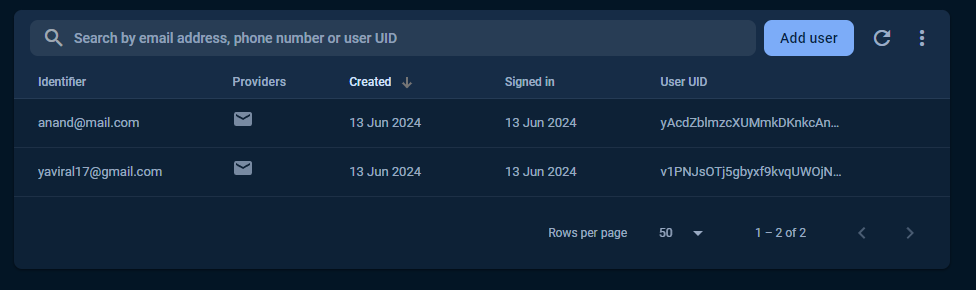

# Memotask

This is a MCQ based quiz app. It is a simple quiz app that has a list of questions and the user can select the correct answer from the given options. The user can also see the correct answer after submitting the answer. The user can maintain a streak.

## How to setup this flutter project
> Clone the repository
```bash
git clone https://github.com/yaviral17/memotask.git
```
> Change the directory
```bash
cd memotask
```
> Get the dependencies
```bash
flutter pub get
```
> Setup firebase project
```bash 
flutterfire configure --project=<project_id>
```
> Add the google-services.json file in android/app folder
```bash
Download the google-services.json file from firebase console and add it in android/app folder
```
>  if you want to debug the app
```bash
flutter run
```
>  if you want to build the app
```bash
flutter build apk --split-per-abi
```

## How To Use This App
- Before starting the quiz, the user needs to login/sign in with email and password.
-   
-   
- After login, the user can see the list of questions.
- 

## Backend 
> - #Firebase Authentication
> 
> - User Collection
> 
> - User Data
> 
> - Question Collection
> 


## Direct Download app
- [Download the app](app-armeabi-v7a-release.apk)
